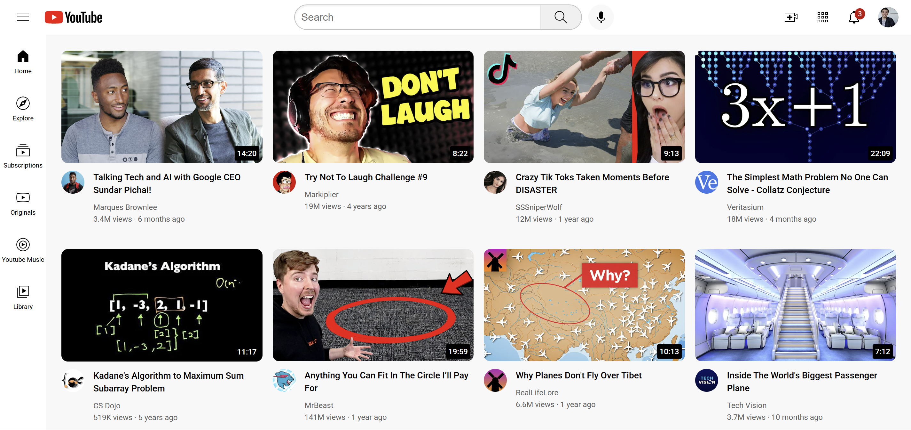

# YouTube Clone 🎥

A front-end clone of the YouTube homepage built using **HTML** and **CSS**. This project replicates the layout of YouTube’s desktop UI, including the header, sidebar, and video grid. It was built as part of my learning journey to practice responsive design and clean HTML/CSS structure.

---

## 🚀 Live Demo

👉 [Check it out here](https://aditi-jadhav-arch.github.io/youtube-clone/)

---

## ✨ Features

- Responsive layout (desktop view)
- YouTube-style header with search and icons
- Sidebar with navigation icons
- Video grid with thumbnails and details
- Clean, modular file structure

---

## 🛠️ Tech Stack

- HTML5
- CSS3
- No frameworks or JavaScript used

---

## 📸 Screenshot

---

## 📁 Folder Structure

youtube-clone/
├── index.html
├── styles/
│ ├── general.css
│ ├── header.css
│ ├── sidebar.css
│ └── video.css
├── thumbnails/
├── icons/
├── channel-pictures/
└── screenshot.png
